# 📘 **TUGAS 9 (Pertemuan 11) — Full Stack Mobile Development**

### 🚀 **Aplikasi TokoKita: Implementasi CRUD Lengkap**
**Integrasi Flutter BLoC dengan REST API CodeIgniter 4**

---

<div align="center">


</div>

---

# 👤 **Identitas Mahasiswa**

| Atribut | Detail Data |
| :--- | :--- |
| **Nama** | Defit Bagus Saputra |
| **NIM** | H1D023036 |
| **Kelas** | Pemrograman Mobile (Shift C/F) |
| **Topik** | CRUD Full Stack (Create, Read, Update, Delete) |

---

# 📸 **Dokumentasi & Alur Proses CRUD**

Berikut adalah dokumentasi lengkap penggunaan aplikasi TokoKita beserta penjelasan teknis di balik layar.

## 1️⃣ **Proses Registrasi**

Pendaftaran pengguna baru untuk mendapatkan akses ke sistem.

### **a. Input Data Registrasi**
Pengguna mengisi **Nama**, **Email**, dan **Password**.

<div align="center">
  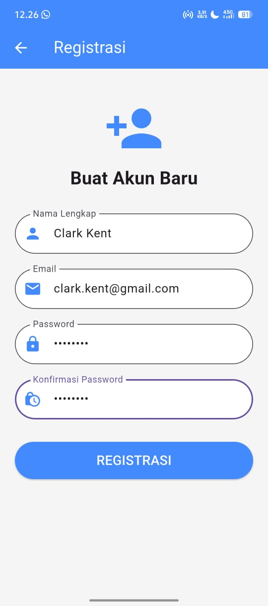
</div>

> **Penjelasan:** Form divalidasi agar email sesuai format dan password minimal 6 karakter. Saat tombol ditekan, data dikirim ke `RegistrasiBloc`.

### **b. Registrasi Berhasil**
Jika sukses, server merespon dengan status 200 dan muncul popup sukses.

<div align="center">
  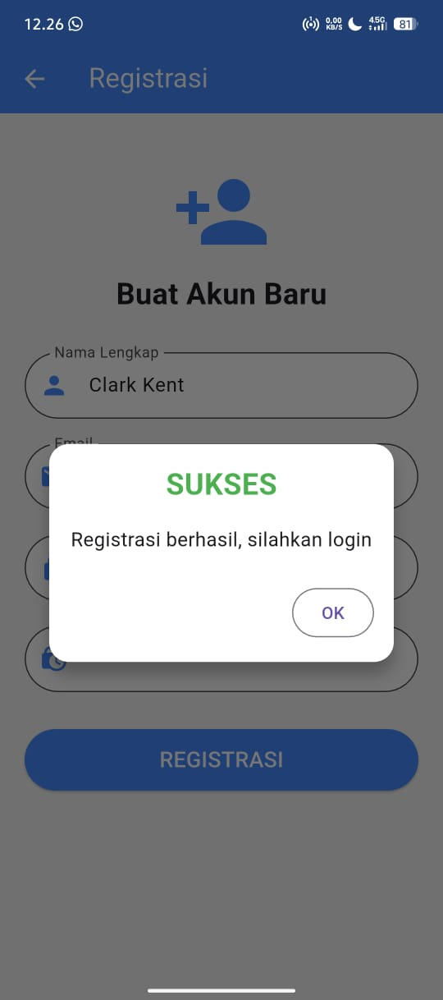
</div>

**Kode Implementasi (`registrasi_page.dart`):**
```dart
RegistrasiBloc.registrasi(
  nama: _namaTextboxController.text,
  email: _emailTextboxController.text,
  password: _passwordTextboxController.text,
).then((value) {
  showDialog(
    context: context,
    builder: (BuildContext context) => SuccessDialog(
      description: "Registrasi berhasil, silahkan login",
      okClick: () => Navigator.pop(context),
    ),
  );
}, onError: (error) {
  // Error handling
});
```

---

## 2️⃣ **Proses Login**

Autentikasi pengguna untuk mendapatkan Token JWT.

### **a. Mengisi Kredensial**

Pengguna memasukkan Email dan Password yang telah terdaftar.

<div align="center">
  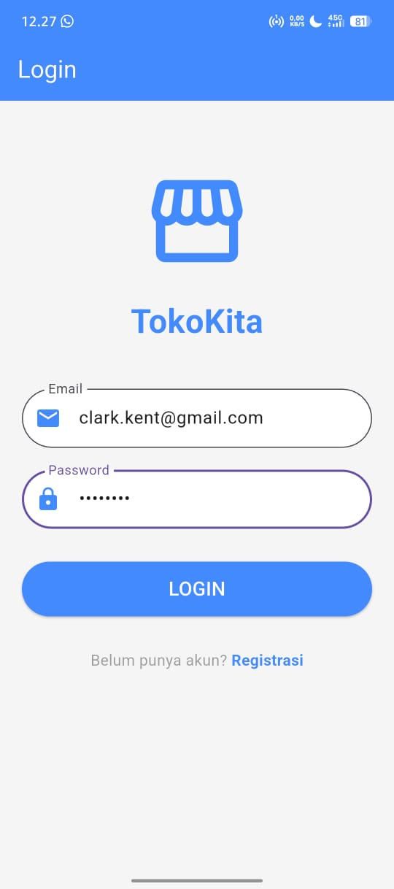
</div>

> **Penjelasan:** Aplikasi mengirim request POST ke endpoint `/login`.

### **b. Login Berhasil (Masuk ke Dashboard)**

Jika kredensial valid, Token disimpan di `SharedPreferences` dan pengguna diarahkan ke halaman List Produk.

<div align="center">
  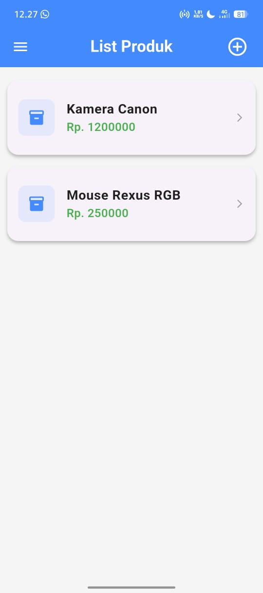
</div>

**Kode Implementasi (`login_page.dart`):**

```dart
LoginBloc.login(
  email: _emailTextboxController.text,
  password: _passwordTextboxController.text
).then((value) async {
  if (value.code == 200) {
    await UserInfo().setToken(value.token.toString());
    await UserInfo().setUserID(int.parse(value.userID.toString()));
    
    Navigator.pushReplacement(context,
        MaterialPageRoute(builder: (context) => const ProdukPage()));
  } else {
    showDialog(...);
  }
});
```

---

## 3️⃣ **Proses Tambah Data (Create)**

Menambahkan produk baru ke database.

### **a. Form Tambah Produk**

Pengguna mengisi **Kode Produk**, **Nama Produk**, dan **Harga**.

<div align="center">
  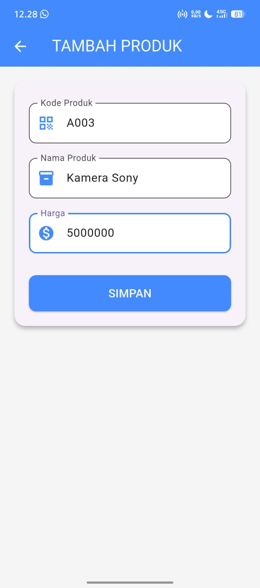
</div>

> **Penjelasan:** Form ini menggunakan `ProdukForm` dalam mode "Tambah" (karena parameter produk null).

### **b. Data Berhasil Disimpan**

Setelah simpan sukses, pengguna kembali ke list dan data "Kamera Sony" muncul.

<div align="center">
  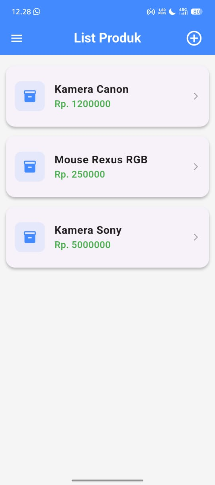
</div>

**Kode Implementasi (`produk_form.dart`):**

```dart
Produk createProduk = Produk(id: null);
createProduk.kodeProduk = _kodeProdukTextboxController.text;
createProduk.namaProduk = _namaProdukTextboxController.text;
createProduk.hargaProduk = int.parse(_hargaProdukTextboxController.text);

ProdukBloc.addProduk(produk: createProduk).then((value) {
  Navigator.of(context).push(MaterialPageRoute(
      builder: (BuildContext context) => const ProdukPage()));
}, onError: (error) {
  _showWarning("Simpan gagal, silahkan coba lagi");
});
```

---

## 4️⃣ **Proses Edit Data (Update)**

Memperbarui data produk yang sudah ada.

### **a. Membuka Detail & Form Edit**

Dari detail produk, tekan tombol **EDIT**. Form terbuka dengan data lama terisi otomatis.

<div align="center">
  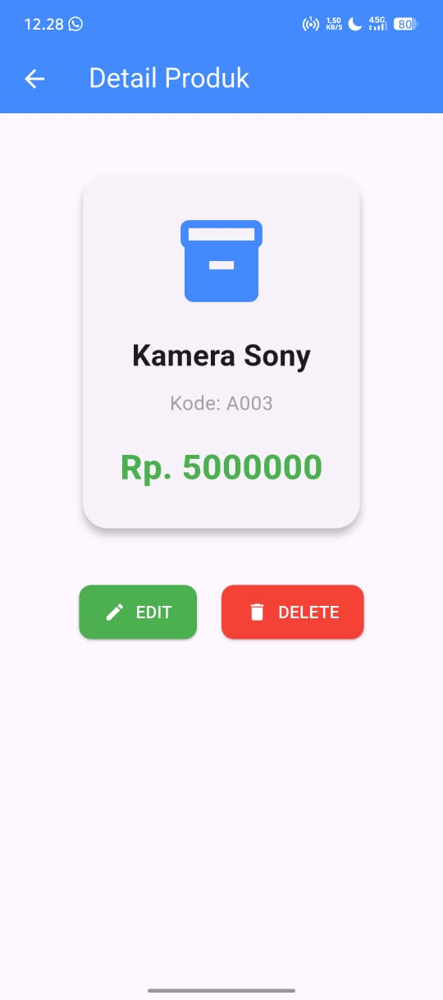
  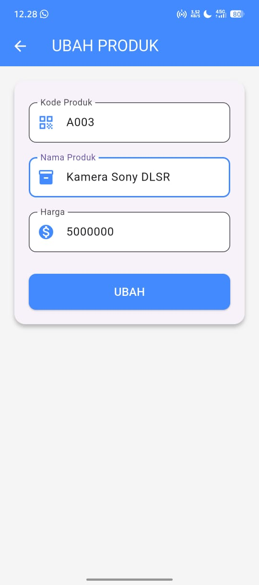
</div>

> **Penjelasan:** Data dikirim menggunakan method `PUT`.

### **b. Edit Berhasil**

Data pada list berubah sesuai inputan terbaru.

<div align="center">
  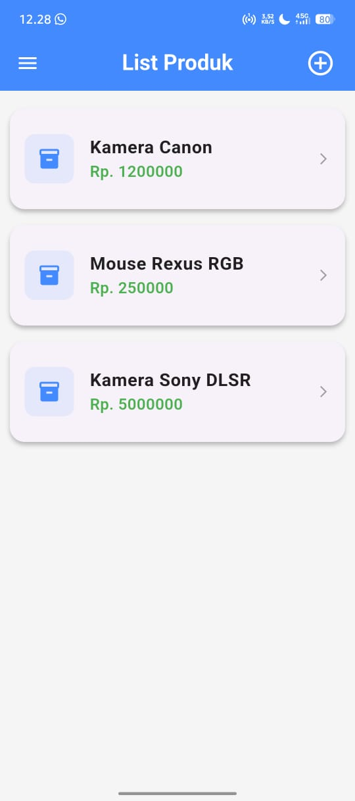
</div>

**Kode Implementasi (`produk_form.dart`):**

```dart
Produk updateProduk = Produk(id: widget.produk!.id!);
updateProduk.kodeProduk = _kodeProdukTextboxController.text;
updateProduk.namaProduk = _namaProdukTextboxController.text;
updateProduk.hargaProduk = int.parse(_hargaProdukTextboxController.text);

ProdukBloc.updateProduk(produk: updateProduk).then((value) {
  Navigator.of(context).push(MaterialPageRoute(
      builder: (BuildContext context) => const ProdukPage()));
}, onError: (error) {
  _showWarning("Ubah data gagal");
});
```

---

## 5️⃣ **Proses Hapus Data (Delete)**

Menghapus data produk permanen.

### **a. Konfirmasi Hapus**

Saat tombol **DELETE** ditekan, muncul peringatan untuk mencegah ketidaksengajaan.

<div align="center">
  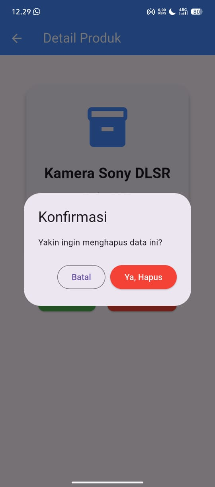
</div>

> **Penjelasan:** Jika "Ya, Hapus" ditekan, ID produk dikirim ke API dengan method `DELETE`.

### **b. Hapus Berhasil**

Produk hilang dari list.

<div align="center">
  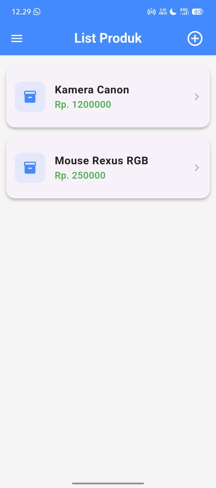
</div>

**Kode Implementasi (`produk_detail.dart`):**

```dart
onPressed: () {
  ProdukBloc.deleteProduk(id: int.parse(widget.produk!.id!)).then(
      (value) => {
            Navigator.of(context).pushAndRemoveUntil(
                MaterialPageRoute(
                    builder: (context) => const ProdukPage()),
                (route) => false)
          }, onError: (error) {
    showDialog(...);
  });
},
```

---

# 🛠️ **Struktur & Konfigurasi**

Aplikasi menggunakan arsitektur BLoC sederhana (Business Logic Component) untuk memisahkan UI dari proses API.

* **`lib/bloc`**: Menangani request ke API (Login, Registrasi, Produk).
* **`lib/ui`**: Menangani tampilan (Page & Form).
* **`lib/helpers`**: Menangani Shared Preference (Token) dan Exception.

```plaintext
Copyright © 2025 Defit Bagus Saputra
```

